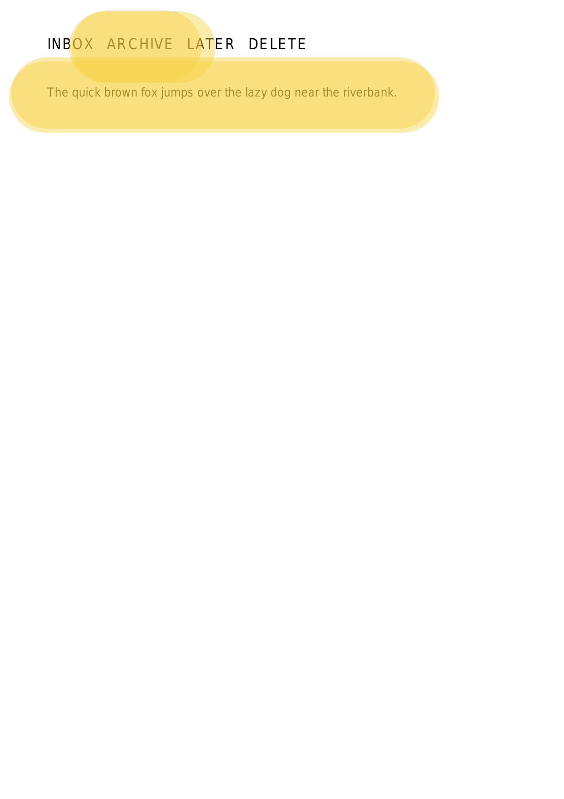
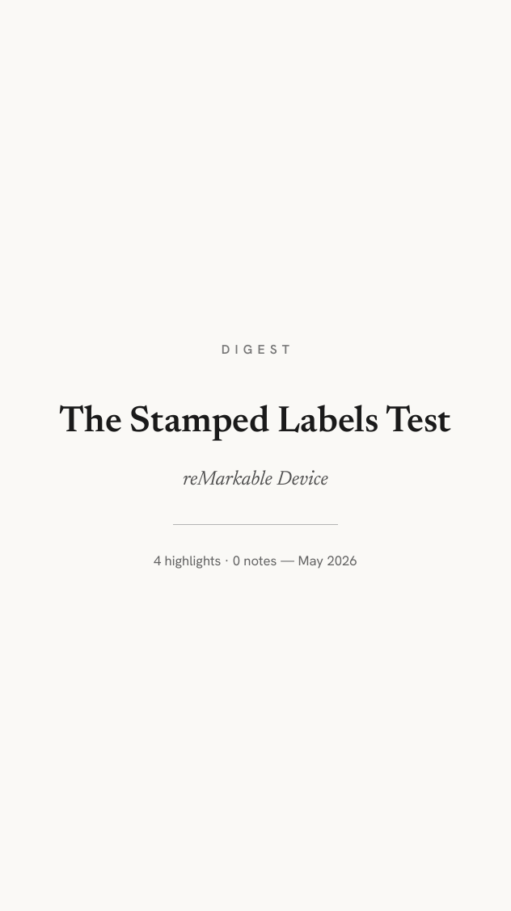
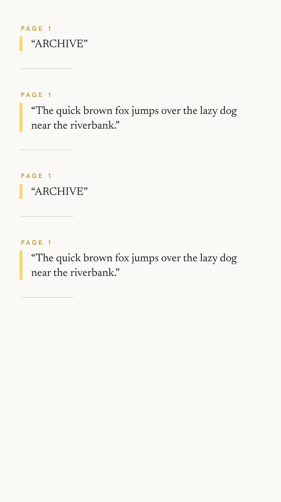

# rmapps

**One tool that turns your reMarkable into a planner, a read-it-later device, and a notebook that summarizes its own annotations — all synced over the air, with no cables and no rmapi.**

<p align="center">
  
</p>

`rmapps` is a single command-line app for getting useful things *onto* your reMarkable and pulling your own ink *back off* it. It talks to the reMarkable Cloud directly with a native, pure-Rust client, so once you pair a machine it just works in the background.

```
rmapps bujo      # generate a full year of bullet-journal notebooks
rmapps reader    # send your Readwise Reader articles over as clean PDFs
rmapps digest    # summarize the highlights & handwriting you've added to a doc
rmapps sync      # run all of the above on a schedule
```

---

## What it can do for you

### 📒 A bullet journal that fills itself in — `rmapps bujo`

Generate a complete year of dot-grid bullet-journal notebooks and push them to your tablet:

- **Daily, weekly, monthly, and yearly pages** laid out on a clean dot grid, ready to write on.
- **Your real calendar baked in.** Point it at any number of `.ics` feeds (Google Calendar, work calendar, a shared family calendar) and your events appear on the right days, each feed in its own color.
- **Regenerate without losing your ink.** Already wrote on this month's pages? Re-running updates the calendar data while *preserving everything you've handwritten on the device*. Update just one month, this month and onward, or the whole year.
- **Themeable** — pick a visual theme, set your week start, time zone, and how many pages per day you want.

<table>
<tr>
<td align="center"><br><sub><b>Cover</b></sub></td>
<td align="center"><br><sub><b>Monthly index</b> — a badge counts each day's events.</sub></td>
<td align="center"><br><sub><b>Day detail</b> — agenda with times, location, color per calendar.</sub></td>
<td align="center"><br><sub><b>Daily page</b> — dot grid with a tap-back link.</sub></td>
</tr>
</table>

### 📖 Your reading list, as paper — `rmapps reader`

Send the articles you've saved in [Readwise Reader](https://readwise.io/read) to your reMarkable as clean, readable PDFs:

- Pulls from the collections you choose (your library, a feed, specific locations).
- Renders articles into **distraction-free reader PDFs** — real text, embedded images, no web clutter.
- **Reads your annotations back.** After you've highlighted and scribbled on an article, rmapps can pull those annotations off the device for you.

<table>
<tr>
<td align="center"><br><sub><b>Feed index</b> — a typographic table of contents, newest first.</sub></td>
<td align="center"><br><sub><b>Article page</b> — clean text with a nav bar and highlightable action band.</sub></td>
<td align="center"><br><sub><b>Inline links & byline</b> preserved from the original.</sub></td>
</tr>
</table>

### ✍️ Notebooks that summarize themselves — `rmapps digest`

Point it at the documents you've been marking up and it builds a **digest of your own annotations**:

- Extracts your **highlights** and the **handwritten ink** you added to PDFs and notebooks.
- Produces a per-document summary PDF and files it right next to the original on your device.
- Works on the reMarkable Paper Pro's highlighter strokes — it reads the actual `.rm` scene files, not a screenshot.

<table>
<tr>
<td align="center"><br><sub><b>Your source</b> — a marked-up page with highlights and handwriting.</sub></td>
<td align="center"><br><sub><b>Digest cover</b> — filed next to the original.</sub></td>
<td align="center"><br><sub><b>Digest body</b> — every highlight and note, collected.</sub></td>
</tr>
</table>

### 🔁 Set it and forget it — `rmapps sync`

Describe the tasks you want in one config file and `rmapps sync` runs them in a single pass — refresh the bujo calendar, pull new reading, rebuild digests. Drop it in a cron job or systemd timer and your tablet stays current on its own.

### 🗂️ Manage your cloud from the terminal — `rmapps ls` / `rmapps rm`

- `rmapps ls /Books` — list what's in any folder.
- `rmapps rm /Books/Old --recursive` — delete a document or a whole folder.

---

## Getting started

### 1. Build it

It's a single Rust workspace — one build gives you the `rmapps` binary:

```sh
cargo build --release
# binary at ./target/release/rmapps
```

> On Nix, a dev shell for each crate is available (`nix develop ./crates/rmbujo`), but a plain `cargo build` from the repo root builds everything.

### 2. Pair your tablet (once per machine)

Open <https://my.remarkable.com/device/desktop/connect>, grab the 8-character code, and:

```sh
rmapps auth login            # paste the code when prompted
rmapps auth status           # confirm the credential works
```

Pairing is **native** — no rmapi, no extra tooling. Only a long-lived device token is stored, at `~/.config/rmapps/auth.json` (mode 0600); the short-lived session token is refreshed automatically whenever it's needed. `rmapps auth logout` removes it.

### 3. Configure what you want

Everything lives in one file: `~/.config/rmapps/config.toml`. Each feature is an optional section — set up only the ones you use.

```toml
# Bullet journal
[bujo]
year = 2026
week_start = "monday"
timezone = "America/Halifax"
theme = "default"
pages_per_day = 1

  [[bujo.ics]]
  name = "Personal"
  url  = "https://calendar.google.com/.../basic.ics"
  # color is auto-assigned if you omit it

# Readwise Reader → reader PDFs
[reader]
  [reader.readwise]
  token = "..."             # https://readwise.io/access_token

# Annotation digests
[digest]
# (see `rmapps digest --help` for options)

# Run these together on `rmapps sync`
[[sync]]
app = "bujo"
[[sync]]
app = "reader"
```

### 4. Run it

```sh
rmapps bujo                  # deploy the whole year
rmapps bujo --only-month 6   # refresh just June, leave the rest (and your ink) alone
rmapps reader                # send your reading list over
rmapps digest --dry-run      # preview what would be summarized
rmapps sync                  # do all configured tasks in one pass
```

Most commands support `--help` for the full set of flags.

---

## Good to know

- **Your handwriting is safe.** Anything that re-deploys a notebook uses a content-only update that keeps the ink already on your device. (Reader PDFs are the exception — they're write-only, so they're replaced wholesale.)
- **No cables, no rmapi.** Sync happens entirely through the reMarkable Cloud over the network.
- **Pure Rust.** The cloud client, the `.rm` scene-file reader, and the PDF generators are all native — fast, single binary, no Python or Node runtime to install.

## License

MIT — see [LICENSE](LICENSE).
